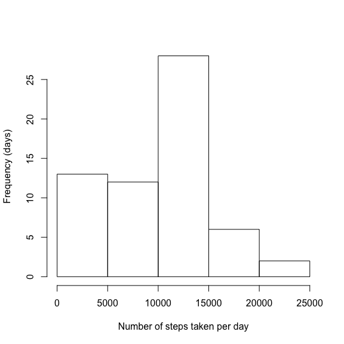
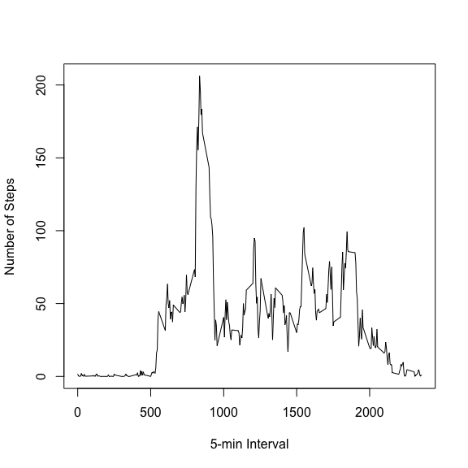
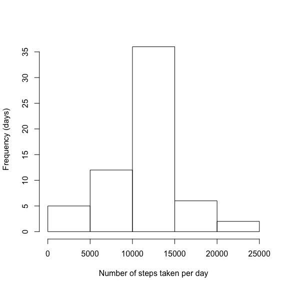
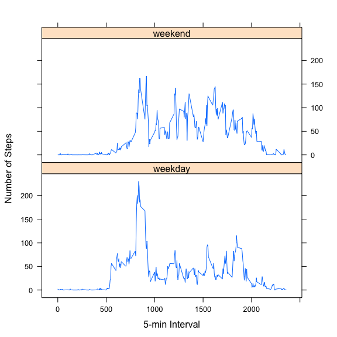

# Reproducible Research: Peer Assessment 1


***
## Introduction
It is now possible to collect a large amount of data about personal
movement using activity monitoring devices such as a
[Fitbit](http://www.fitbit.com), [Nike
Fuelband](http://www.nike.com/us/en_us/c/nikeplus-fuelband), or
[Jawbone Up](https://jawbone.com/up). These type of devices are part of
the "quantified self" movement -- a group of enthusiasts who take
measurements about themselves regularly to improve their health, to
find patterns in their behavior, or because they are tech geeks. But
these data remain under-utilized both because the raw data are hard to
obtain and there is a lack of statistical methods and software for
processing and interpreting the data.

This report analyzes the data collected from a personal activity monitoring device. 
The data include the number of steps taken in 5 minute intervals each day for 
two months (October and November, 2012) collected from an anonymous individual. 

## Data 

* Dataset: activity.zip in the working directory, which can also be downloaded 
from [here](https://d396qusza40orc.cloudfront.net/repdata%2Fdata%2Factivity.zip). 
The dataset is stored in a comma-separated-value (CSV) file.

The variables included in this dataset are:

* **steps**: Number of steps taking in a 5-minute interval (missing
    values are coded as `NA`)

* **date**: The date on which the measurement was taken in YYYY-MM-DD
    format

* **interval**: Identifier for the 5-minute interval in which
    measurement was taken

***
## Report


In the following report, I will describe data analysis in steps, and answer some 
of the interesting questions (see below).

### Loading and preprocessing the data

First load the data assuming that "activity.zip" is in the current folder.  


```r
# load the required packages
library(lubridate)
library(dplyr)

# read the data from the zip file
dat <- read.csv(unz("activity.zip", "activity.csv"))
```

Preprocess the data for analysis


```r
# transform variable date from character to POSIXct 
dat$date <- ymd(dat$date)
```

### What is mean total number of steps taken per day?
Let's first take a look at the distribution of the total number of steps taken per day.


```r
groupByDate <- 
    dat %>% 
    group_by(date) %>%
    summarize(dateSum=sum(steps, na.rm=T))

hist(groupByDate$dateSum, xlab="Number of steps taken per day", ylab="Frequency (days)", main="")
```

 

The mean total number of steps taken per day is 9354.
The median total number of steps taken per day is 10395.


```r
round(mean(groupByDate$dateSum, na.rm=T))
```

```
## [1] 9354
```

```r
median(groupByDate$dateSum, na.rm=T)
```

```
## [1] 10395
```

### What is the average daily activity pattern?

Here is a time series plot of the 5-minute interval (x-axis) and the average number of steps taken, averaged across all days (y-axis).  It clearly indicates that the number of steps taken peak around 8-9 am.  


```r
groupByInterval <- 
    dat %>% 
    group_by(interval) %>%
    summarize(intervalMean=mean(steps, na.rm=T))
plot(groupByInterval, type="l", xlab="5-min Interval", ylab="Number of Steps")
```

 

To be exact, the maximum number of steps across all days was taken at 5-min interval "835", which corresponds to 8:35am.


```r
groupByInterval$interval[which(groupByInterval$intervalMean==max(groupByInterval$intervalMean))]
```

```
## [1] 835
```

### Imputing missing values


There are 2304 intervals with missing values in the dataset.


```r
sum(is.na(dat$steps))
```

```
## [1] 2304
```

Because missing values may introduce bias into some calculations or summaries of the data,  all of the missing values at some intervals were filled in with the mean for that 
particular interval. Now as expected, the number of intervals with missing values become 0.


```r
newDat <- dat
idx<-which(is.na(newDat$steps))
newDat$steps[idx] <- sapply(idx, function(i) 
        groupByInterval$intervalMean[ which(groupByInterval$interval== newDat$interval[i])])
```


```r
sum(is.na(newDat$steps))
```

```
## [1] 0
```

The distribution of the total number of steps taken per day on the new dataset is shown below. It is similar to the one ontained from the old data set with missing values.  But the new one is more normally distributed with higher values of mean and median total number of steps taken per day.  


```r
groupByDate2 <- 
    newDat %>% 
    group_by(date) %>%
    summarize(dateSum=sum(steps))

hist(groupByDate2$dateSum, xlab="Number of steps taken per day", ylab="Frequency (days)", main="")
```

 

The mean total number of steps taken per day now is 10766.
The median total number of steps taken per day now is 10766. 


```r
round(mean(groupByDate2$dateSum))
```

```
## [1] 10766
```

```r
round(median(groupByDate2$dateSum))
```

```
## [1] 10766
```

### Are there differences in activity patterns between weekdays and weekends?

Create a new factor variable in the dataset with two levels -- "weekday" and "weekend" indicating whether a given date is a weekday or weekend day.


```r
dat2 <- newDat
dat2$wkday <- sapply(weekdays(dat$date), function(d) { if (d == "Saturday" | d == "Sunday") "weekend"
                                                    else "weekday"})
```

As shown in the panel plot containing a time series plot of the 5-minute interval (x-axis) and the average number of steps taken, averaged across all weekday days or weekend days (y-axis),  the activity pattern in the weekdays is quite different form that in the weekends.  In the weekdays, number of steps peaks around the 8-9am in the morning, which is not seen in the weekends.


```r
groupByIntervalWkday <- 
    dat2 %>% 
    group_by(interval, wkday) %>%
    summarize(intervalMean=mean(steps, na.rm=T))

library(lattice)
xyplot(intervalMean ~ interval | wkday, groupByIntervalWkday, type = "l", 
       xlab="5-min Interval", ylab="Number of Steps", layout=c(1,2))
```

 


